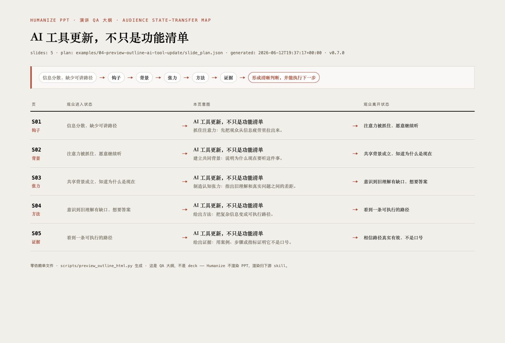

<div align="center">

# Humanize PPT

## Render-QA inspector for agent-made PPTs (v0.7.0)

> *Everyone is teaching AI to render beautiful slides. Nobody is watching how badly they come out.*

**Turn raw material into an audience-aware AST outline + per-page media decisions, hand a production brief to a native downstream PPT skill — then watch the rendered output: scan failure modes, write fix prompts, cap at 3 rounds. Template skills own "looks good"; Humanize owns "someone checked". It never renders HTML itself.**

[Live Preview](https://learnprompt.github.io/humanize-ppt/) · [Release](https://github.com/LearnPrompt/humanize-ppt/releases) · [MIT License](LICENSE)

[中文](README.md) · [AST Theory](docs/AST-theory.md) · [v0.7.0 Release Notes](docs/versions/v0.7.0-render-qa-inspector.md)

</div>

---

## Showcase

Humanize PPT is a **render-QA inspector**: in the first half it orchestrates the brief — turning source material into an AST outline + per-page media decisions (image / SVG diagram / Remotion video / nothing) and writing a `<renderer>-production-prompt.md` for a downstream PPT skill to render 100% natively. In the second half it watches the render — a 3-iteration QA loop scans the rendered HTML for failure modes and writes fix prompts. It does **not** render HTML itself.

`examples/03-codex-guizang-native-ink-classic/` is the verified **known-good Guizang Style A / Ink Classic sample** (10 slides, 86 `data-anim`, WebGL hero background). It was produced by `guizang-ppt-skill`, not by Humanize — it serves as the visual baseline for the v0.6.4 QA loop.

> This deck is the native product of `guizang-ppt-skill`. Humanize only wrote the brief and ran the QA.

## Speech QA outline: see the audience state arc before rendering

Since v0.7.0, Humanize has its first screenshot-able artifact of its own — not a deck (rendering stays downstream), but the **inspector's worksheet**: an audience state-transfer map. Input `slide_plan.json`, output a single-file zero-dependency HTML page — one row per slide ("slide id → state the audience walks in with → page intent → state they walk out with"), with a one-line state-arc summary on top. Five minutes of human review before any render happens.

<p align="center">
  
</p>

<p align="center"><sub>
▲ Real artifact: <code>examples/01-ai-tool-update/source.md</code> run through brief mode produced the <code>slide_plan.json</code>; <code>scripts/preview_outline_html.py</code> rendered the map. Files live in <code>examples/04-preview-outline-ai-tool-update/</code>.
</sub></p>

```bash
python3 scripts/preview_outline_html.py \
  --slide-plan <out>/slide_plan.json \
  --out <out>/preview-outline.html \
  --title "Your deck title"
```

It is the same checkpoint as `--preview-outline` (the built-in markdown outline review, since v0.6.6) in a second form: markdown for the agent to read, this HTML page for humans and screenshots.

## QA crash gallery: before / after

**Reserved — intentionally empty.** This section is waiting for the first *real* QA-loop catch: the downstream render's before (a `qa_report.md` finding + screenshot) and the after following a fix-prompt re-render, in the same format as `examples/03-codex-guizang-native-ink-classic/` — real run artifacts, reproducible paths, no staging. Until a real case lands, it stays empty.

If your deck got caught by the QA loop in a way worth showing (`placeholder-residue`, `webgl-canvas-missing`, `swiss-sxx-invented-id`… see the [failure-mode catalog](references/qa-failure-modes.md)), open an issue.

## 30-second start: ask your agent to install and use it

If you use Codex, Claude Code, Hermes, or another Skill-aware agent, send it this:

```text
Please install and use the Humanize PPT Skill (v0.7.0+):
https://github.com/LearnPrompt/humanize-ppt

I want to create a presentation. Follow these three steps. Do NOT let Humanize
render any HTML itself — that's the downstream skill's job.

1. Use Humanize PPT to produce the AST outline + per-page media decisions
   (image / SVG / Remotion video). It writes a <renderer>-production-prompt.md.

2. Take that prompt and invoke the downstream skill to render natively:
   - Chinese: guizang-ppt-skill, following the Style (A/B) in the prompt
   - English: frontend-slides or beautiful-html-templates, with their own
     template selection + full deck

3. After the deck is rendered, run the Humanize PPT QA loop on it:
   python3 scripts/humanize_ppt.py --qa-from <rendered.html> --out <out> \\
     --renderer guizang --guizang-style A --max-qa-iterations 3
   Max 3 rounds. Converge = done. If still failing, send the fix_prompt.md
   back to the downstream skill to re-render.

4. After QA passes, let the downstream skill produce its native speaker
   notes + presenter shell + deploy. Humanize does not own those.

Please confirm humanize-ppt, guizang-ppt-skill (or frontend-slides /
beautiful-html-templates) are all available. Humanize no longer imitates
any downstream skill — it only writes briefs and runs QA.
```

If your agent needs an explicit install command, ask it to run:

```bash
npx skills add LearnPrompt/humanize-ppt -g
```

## How to talk to the agent

The v0.6.4 conversational model is "Humanize writes a brief → downstream skill renders natively → Humanize runs QA". Drive the agent around this loop:

```text
I have material about "AI tool updates". Use Humanize PPT to produce the
AST outline + per-page media decisions. The audience is a product team.
The point is not a feature list; I want them to understand how these
tools change the workflow.
```

```text
The brief looks right. Hand it to guizang-ppt-skill and render the Chinese
deck natively (Style A). After rendering, run Humanize PPT --qa-from for
up to 3 rounds. If a hero page loses the WebGL background, send the
fix_prompt.md back to guizang-ppt-skill to re-render.
```

```text
After QA converges, ask guizang-ppt-skill to produce its native speaker
notes + presenter shell, then deploy to GitHub Pages and give me the URL.
```

## CLI reproduction

### Brief mode (default)

```bash
python3 scripts/humanize_ppt.py \
  --source examples/01-ai-tool-update/source.md \
  --out .humanize-ppt-runs/ai-tool-update-v0.6.4 \
  --title "AI 工具更新，不只是功能清单" \
  --renderer guizang \
  --guizang-style A
```

You get `guizang-production-prompt.md`. **No** `outputs/guizang/index.html` is produced. Hand the prompt to `guizang-ppt-skill` to render.

### QA mode (post-render)

```bash
python3 scripts/humanize_ppt.py \
  --qa-from .humanize-ppt-runs/ai-tool-update-v0.6.4/rendered/index.html \
  --out .humanize-ppt-runs/ai-tool-update-v0.6.4 \
  --renderer guizang \
  --guizang-style A \
  --max-qa-iterations 3
```

You get `outputs/qa/qa_report.md` / `fix_prompt.md` / `qa_iteration.json`. After 3 rounds with remaining failures → `needs-human`.

## What it does

- **AST outline**: audience, state transfer, slide intent, speaking rhythm.
- **Per-page media decision**: which page wants an image, a system diagram, a 10-second process clip, nothing.
- **Production brief**: a single `<renderer>-production-prompt.md` for the next agent. No template copy, no `SLIDES_HERE` injection, no post-process.
- **QA loop**: scans the rendered HTML for failure modes (`references/qa-failure-modes.md`), writes fix prompts for the downstream skill, max 3 rounds, then `needs-human`.
- **Speech QA outline**: renders the audience state-transfer map (zero-dependency single-file HTML) from `slide_plan.json` for a human pass before any render.

## Good fit / Not a fit

Good fit:

- You have source material, a topic, or a rough outline, and need an AST outline + per-page media decisions + a brief handoff to a native downstream skill.
- You want Chinese decks to default to `guizang-ppt-skill` natively, with Humanize watching the QA loop.
- You want English decks to go through `frontend-slides` / `beautiful-html-templates` native templates.
- You want Humanize to be immune to downstream skill updates — it only writes briefs, never imitates templates.

Not a fit:

- You only need a one-off template library.
- You expect Humanize to render HTML itself. (v0.6.4 deliberately does not — the downstream skill is the renderer.)
- You do not yet know the audience, topic, or delivery setting.

## Workflow paths

v0.6.4 splits the workflow into four stages O / P / Q / C:

- **O — Outline + Per-Page Media Direction** (Humanize): raw material → AST outline + per-page image / video decision
- **P — Native Renderer Invocation** (downstream skill 100%): Chinese `guizang-ppt-skill`, English `frontend-slides` / `beautiful-html-templates`
- **Q — Conversational QA Loop** (Humanize `--qa-from`): scan failure modes → write `fix_prompt.md` → wait for downstream re-render → converge, max 3 rounds
- **C — Complete** (downstream skill native): speaker notes / presenter shell / static deploy — **not owned by Humanize**

Humanize PPT's current focus is the stable "material → AST + brief → downstream native → QA loop → deploy" workflow.

**Media boundary:** video and motion material is decided in `slide_plan.json`'s `media.video` field and `video_slots.json` — those decision fields stay. But the **media pipeline itself is downstream-owned**: Remotion / HyperFrames rendering, static fallbacks, and embedding are the downstream skill's job. This repo does not fix, take over, or verify that pipeline.

## English path, stated honestly: brief exit works, the QA leg is unverified

Matching the `support_level` field in `registry/renderer_registry.json`:

| Renderer | support_level | What it actually means |
|---|---|---|
| `guizang-ppt-skill` (Chinese) | `full` | Both the brief exit and the `--qa-from` QA loop are verified on real rendered output; the failure-mode catalog has 7 guizang rules |
| `frontend-slides` (English) | `brief-only` | `frontend-slides-production-prompt.md` is emitted and consumable; but the QA loop has never run on its real rendered output, and no renderer-specific rules exist for it |
| `beautiful-html-templates` (English) | `brief-only` | Same: brief exit works, QA unverified |

This is not a to-do to "go fix English" — it is a boundary statement: **you can use the English brief exit, but we do not promise the QA leg**. The English sections of the failure-mode catalog stay reserved until a real English render goes through `--qa-from` with verified findings (empty over staged — same house rule as the showcase).

## Why AST

Humanize PPT uses AST theory:

- **Audience**: who is listening, what they know, and what they resist;
- **State**: where the audience starts and where the deck should move them;
- **Transfer**: how each slide moves the audience forward.

Core idea:

> PPT is not an information container. PPT is an audience state-transfer artifact.

## No-dependency smoke check

If pytest is unavailable, run the stdlib-only smoke check:

```bash
python3 scripts/smoke_check.py
```

It runs the stable entrypoint through a minimal path that does not require an external template library, then checks for:

```text
deck_brief.md
ast_outline.md
slide_plan.json
router_plan.json
run_manifest.json
outputs/qa/qa_report.md
guizang-production-prompt.md    ← v0.6.4 new: must exist
outputs/guizang/index.html       ← v0.6.4 new: must NOT exist
```

See [docs/smoke-test.md](docs/smoke-test.md).

## Output shape

A brief-mode run produces:

```text
out/
  deck_brief.md
  ast_outline.md
  slide_plan.json            ← per-page media: {image, diagram, video} + layout_hint
  speaker_intent.md
  asset_manifest.md          ← derived from media
  video_slots.json           ← derived from media.video
  style_brief.md
  renderer_registry.json
  router_plan.json
  run_manifest.json
  guizang-production-prompt.md       ← v0.6.4 primary deliverable
  commands/
    guizang-agent.md
  outputs/
    qa/
      qa_report.md           ← first-pass gate
```

QA mode (`--qa-from`) appends `fix_prompt.md` and `qa_iteration.json` to `outputs/qa/`, max 3 rounds.

## Current boundaries

- Recommended entrypoint: `scripts/humanize_ppt.py` (speech QA outline: `scripts/preview_outline_html.py`)
- Historical version notes: `docs/versions/` (why v0.7.0 repositioned: `docs/versions/v0.7.0-render-qa-inspector.md`)
- Plans and reviews: `docs/plans/`
- Safe sample inputs: `examples/`
- v0.6.4 known-good: `examples/03-codex-guizang-native-ink-classic/`
- Renderer support levels: `support_level` in `registry/renderer_registry.json` (guizang `full`; English paths `brief-only`, see above)

## Reference

Humanize PPT is shaped by these projects and operating rules:

- [op7418/guizang-ppt-skill](https://github.com/op7418/guizang-ppt-skill): stable Chinese deck production, Swiss visual constraints, material QA. **Humanize invokes it 100% natively; it never copies its template.**
- [zarazhangrui/beautiful-html-templates](https://github.com/zarazhangrui/beautiful-html-templates): English multi-style candidates and selected-template full deck production.
- [zarazhangrui/frontend-slides](https://github.com/zarazhangrui/frontend-slides): English slide workflow, viewport-safe HTML decks, PPTX, and publishing direction.
- [huggingface/smolagents](https://github.com/huggingface/smolagents): a code-first agent workflow reference for the "read contract, run tools, write back results" collaboration pattern.
- [AST Theory](docs/AST-theory.md) and [OPC Workflow](docs/OPC-workflow.md): Humanize PPT's own outline method, routing model, and execution boundaries.
- [v0.7.0 Release Notes](docs/versions/v0.7.0-render-qa-inspector.md), [v0.6.4 Release Notes](docs/versions/v0.6.4-guizang-production-brief-orchestrator.md), [Brief Specification](references/guizang-production-brief-orchestrator.md), [QA Failure Modes](references/qa-failure-modes.md): the brief-orchestrator + QA-loop contract, and why v0.7.0 repositioned as render-QA inspector.

## License

MIT

---

<div align="center">

**Made by [LearnPrompt](https://github.com/LearnPrompt)** · From the same workshop

[Luban · skill polishing](https://github.com/LearnPrompt/luban-skill) · [Paoding · blogger distilling](https://github.com/LearnPrompt/paoding-skill) · [Cailun · chat-to-page](https://github.com/LearnPrompt/cailun-skill) · [Afu · LLM todo](https://github.com/LearnPrompt/afu-llm-todo) · [AI News Radar · zero-API](https://github.com/LearnPrompt/ai-news-radar) · [Skillrush Town · ClawHub daily](https://github.com/LearnPrompt/skillrush-town) · [Irasutoya Illustrations](https://github.com/LearnPrompt/carl-irasutoya-illustrations) · [Humanize PPT](https://github.com/LearnPrompt/humanize-ppt) · [CC Harness](https://github.com/LearnPrompt/cc-harness-skills)

<sub>WeChat「卡尔的AI沃茨」 · [X @aiwarts](https://x.com/aiwarts) · [learnprompt.pro](https://www.learnprompt.pro)</sub>

</div>
