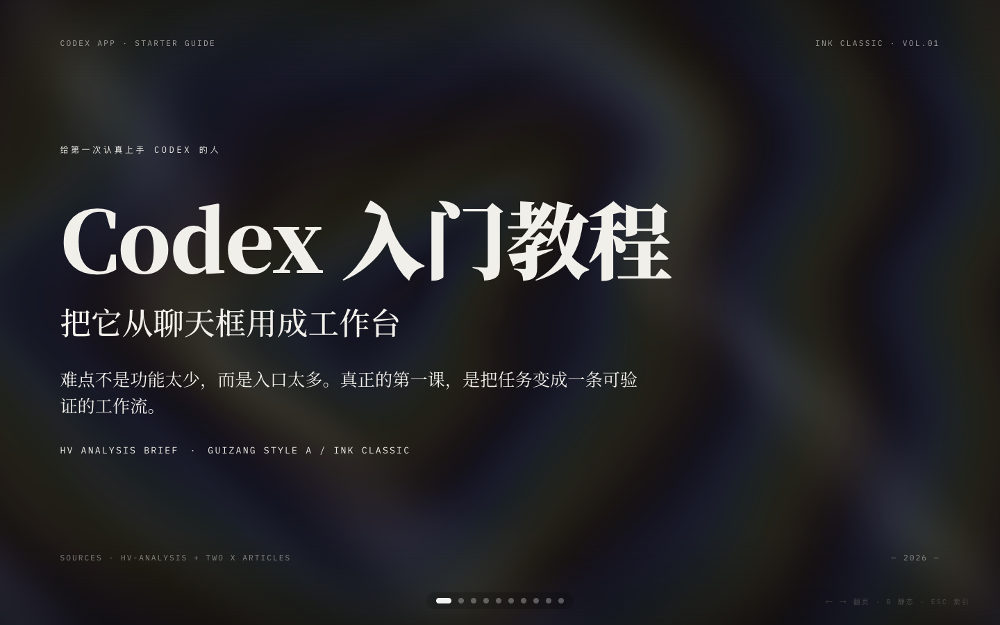
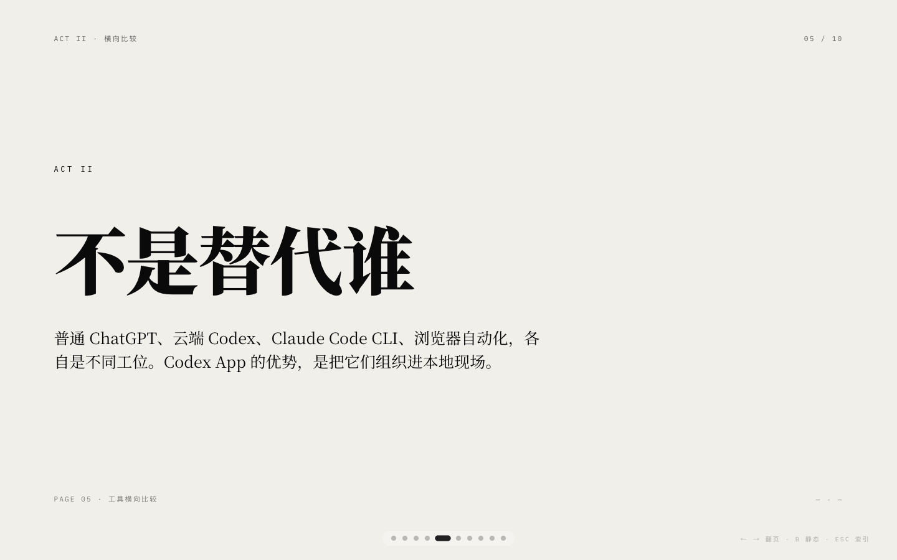
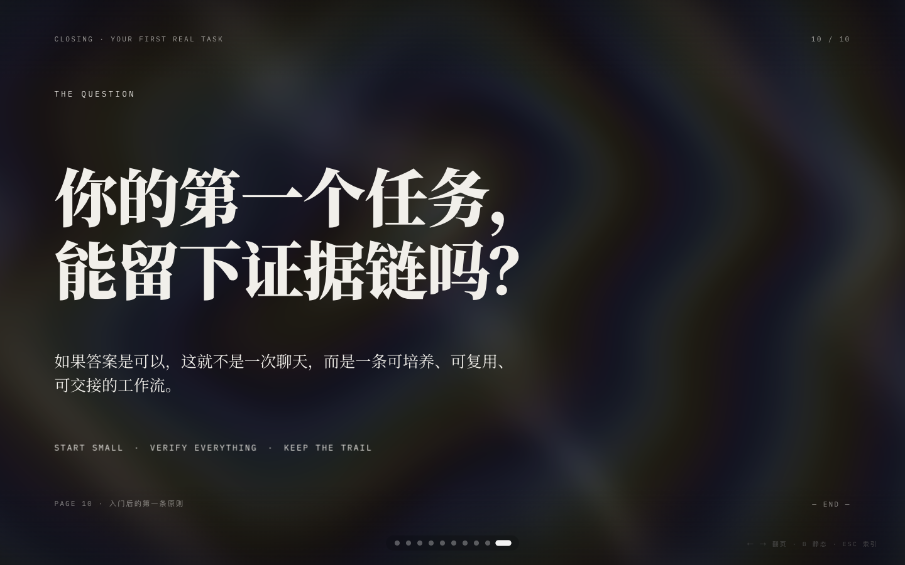

<sub>🌐 <b>中文</b> · <a href="README.en.md">English</a></sub>

<div align="center">

# Humanize PPT

> *「所有人都在教 AI 把 PPT 渲染得好看，没人盯着它渲染完有多烂。」*

[](SKILL.md)
[](https://skills.sh/LearnPrompt/humanize-ppt)
[](https://github.com/LearnPrompt/humanize-ppt/releases)
[](LICENSE)

**面向 Agent 的 PPT 渲染质检员：先把资料编排成 AST 大纲 + 逐页素材决定的简报，交给下游 PPT Skill 100% 原生渲染——然后盯住渲染结果：扫失败模式、写 fix prompt、3 轮封顶。模板库负责渲染得好看，Humanize 负责渲染完有人盯。它自己不渲染。**

[看效果](#效果展示) · [演讲QA大纲](#演讲-qa-大纲渲染之前先看一眼观众状态弧) · [30秒上手](#30-秒开始让-agent-安装并使用) · [触发方式](#触发方式) · [它和同类有什么不同](#它和同类有什么不同) · [安全边界](#安全边界) · [在线预览](https://learnprompt.github.io/humanize-ppt/) · [AST理论](docs/AST-theory.md)

</div>

---

## 效果展示

<p align="center">
  
  
  
</p>

<p align="center"><sub>
▲ Guizang Style A / Ink Classic 已知合格品(10 页 / 86 个 data-anim / WebGL hero)——Humanize 出 brief 和 QA，guizang-ppt-skill 原生渲染。
<a href="https://learnprompt.github.io/humanize-ppt/">在线翻完整 deck →</a>
</sub></p>

Humanize PPT 不抢模板库的工作。它是**渲染质检员**：上半场做简报编排——把资料整理成 AST 大纲 + 逐页素材决定（要不要图、要不要 SVG 示意图、要不要 Remotion 视频），写一份 `*-production-prompt.md` 给下游 Skill 100% 原生渲染；下半场盯渲染结果——QA 循环扫失败模式、写 fix prompt、3 轮封顶。Humanize 自己不出 HTML。

`examples/03-codex-guizang-native-ink-classic/` 是一份**已知合格的 Guizang Style A / Ink Classic 原生成品**（10 页、86 个 `data-anim`、WebGL hero 背景）。它不是 Humanize 的产物——是 `guizang-ppt-skill` 跑出来的，作为 QA 循环的视觉基准。

> 这一页 deck 是 guizang-ppt-skill 原生产物，Humanize 只负责出 brief 和 QA。

## 演讲 QA 大纲：渲染之前，先看一眼观众状态弧

v0.7.0 起，Humanize 有了第一个自己的可截图产物——不是 PPT（渲染归下游），而是**质检员的工作底稿**：观众状态转移图。输入 `slide_plan.json`，输出一页零依赖单文件 HTML：每页一行「页号 → 观众进入状态 → 本页意图 → 离开状态」，顶部一条状态弧摘要。渲染之前人先过一眼：哪一页没有推动状态转移，哪一页在原地踏步，5 分钟看穿。

<p align="center">
  
</p>

<p align="center"><sub>
▲ 真实产物：<code>examples/01-ai-tool-update/source.md</code> 跑 brief 模式得到的 <code>slide_plan.json</code>，再经 <code>scripts/preview_outline_html.py</code> 生成。文件在 <code>examples/04-preview-outline-ai-tool-update/</code>，可直接双击打开。
</sub></p>

```bash
python3 scripts/preview_outline_html.py \
  --slide-plan <out>/slide_plan.json \
  --out <out>/preview-outline.html \
  --title "你的 deck 标题"
```

它和 `--preview-outline`（markdown 版大纲检查点，v0.6.6 起内置）是同一道关的两种形态：markdown 给 Agent 读，这页 HTML 给人看、给截图。

## QA 翻车现场：before / after

**虚位以待。** 这一节留给第一单真实 QA 循环抓到的翻车案例：下游渲染产物的 before（`qa_report.md` 的 finding + 截图）和 fix prompt 重渲后的 after。格式会对齐 `examples/03-codex-guizang-native-ink-classic/` 的写法——真实运行产物、可复现路径、不放摆拍。在第一单真实案例进来之前，这里宁可空着。

如果你的 deck 被 QA 循环抓到过值得示众的翻车（`placeholder-residue`、`webgl-canvas-missing`、`swiss-sxx-invented-id`……见 [QA 失败模式目录](references/qa-failure-modes.md)），欢迎提 issue 投稿。

## 30 秒开始：让 Agent 安装并使用

如果你正在使用 Codex、Claude Code、Hermes 或其他支持 Skill 的 Agent，把这段话发给它：

```text
请安装并使用 Humanize PPT Skill（v0.7.0+）：
https://github.com/LearnPrompt/humanize-ppt

我要做一份 PPT。请按下面三步走，不要让 Humanize 自己渲染任何 HTML：

1. 用 Humanize PPT 生成 AST 大纲 + 逐页素材决定（要不要图、SVG、Remotion 视频）。
   它会输出 <renderer>-production-prompt.md。
2. 拿这份 prompt，调下游 skill 原生渲染：
   - 中文：guizang-ppt-skill，按 prompt 里指定的 Style (A/B) 渲染
   - 英文：frontend-slides 或 beautiful-html-templates，原生模板选择 + 完整 deck
3. 渲染完后，再用 Humanize PPT 跑 QA 循环：
   python3 scripts/humanize_ppt.py --qa-from <rendered.html> --out <之前的 out 目录> --renderer guizang --guizang-style A --max-qa-iterations 3
   最多 3 轮，converge 就好，仍有问题就改 prompt 让下游 skill 重新渲染。
4. QA 通过后，让下游 skill 自己出 speaker notes / presenter shell / 部署。

请确认 humanize-ppt、guizang-ppt-skill（或 frontend-slides / beautiful-html-templates）都可用。
Humanize 不再模仿任何下游 skill——它只发 brief 和盯 QA。
```

如果你的 Agent 需要明确安装命令，可以让它执行：

```bash
npx skills add LearnPrompt/humanize-ppt -g
```

Claude Code 用户也可以走 plugin marketplace（自动更新）：

```text
/plugin marketplace add LearnPrompt/humanize-ppt
/plugin install humanize-ppt
```

## 触发方式

- 「帮我盯一下渲染出来的 PPT 有没有翻车」
- 「PPT 渲染质检」「帮我对这份渲染好的 deck 跑 QA 循环」
- 「这页的 Hero 背景看不见，出 fix prompt 让下游改」
- 「用 humanize-ppt 把这份资料做成 PPT 大纲」
- 「我有一堆笔记/录音转写，要做一份给产品团队看的 PPT」
- 「先出 AST 大纲和逐页素材决定，再调 guizang 渲染」
- 「把这份老 PPT 重新编排成人愿意听的结构」

反向指路：如果你只要一个漂亮模板、或者想让 AI 直接渲染 PPT，不需要 Humanize——直接用 [guizang-ppt-skill](https://github.com/op7418/guizang-ppt-skill)（中文）或 [frontend-slides](https://github.com/zarazhangrui/frontend-slides) / [beautiful-html-templates](https://github.com/zarazhangrui/beautiful-html-templates)（英文）。Humanize 管的是渲染前的编排和渲染后的质检。

## 怎么跟 Agent 交流

当前的对话模型是「Humanize 发 brief → 下游 skill 原生渲染 → Humanize 盯 QA」。你按这个循环给 Agent 下任务：

```text
我有一份关于「AI 工具更新」的资料，请用 Humanize PPT 出 AST 大纲 + 逐页素材决定，
目标是让产品团队理解这些工具会改变工作流。
```

```text
brief 看起来 OK。请按 prompt 调 guizang-ppt-skill 原生渲染中文 deck（Style A）。
渲染完用 Humanize PPT --qa-from 跑 QA，最长 3 轮。
如果某一页 Hero 背景看不见（WebGL 被遮），就把 fix_prompt.md 转给 guizang-ppt-skill 让它改。
```

```text
QA converged 之后，让 guizang-ppt-skill 自己出 speaker notes + presenter shell，
然后部署到 GitHub Pages 给我 URL。
```

## CLI 复现方式

### Brief 模式（默认）

```bash
python3 scripts/humanize_ppt.py \
  --source examples/01-ai-tool-update/source.md \
  --out .humanize-ppt-runs/ai-tool-update-v0.6.4 \
  --title "AI 工具更新，不只是功能清单" \
  --renderer guizang \
  --guizang-style A
```

跑完会得到 `guizang-production-prompt.md`，**不会**有任何 `outputs/guizang/index.html` 之类的 HTML 产物。下一手交给 `guizang-ppt-skill` 渲染。

### QA 模式（拿到渲染产物后）

```bash
python3 scripts/humanize_ppt.py \
  --qa-from .humanize-ppt-runs/ai-tool-update-v0.6.4/rendered/index.html \
  --out .humanize-ppt-runs/ai-tool-update-v0.6.4 \
  --renderer guizang \
  --guizang-style A \
  --max-qa-iterations 3
```

跑完会得到 `outputs/qa/qa_report.md` / `fix_prompt.md` / `qa_iteration.json`。第 3 轮仍 fail → `needs-human`。

## 能力

- **AST 大纲**：把资料转成观众、状态转移、页面意图和讲述节奏。
- **逐页素材决定**：每页要不要图、要不要 SVG/HTML 示意图、要不要 Remotion 视频——Humanize 决定，下游 skill 原生产出。
- **生产简报**：写一份 `<renderer>-production-prompt.md` 给下游 skill 100% 原生渲染，不模仿、不 post-process。
- **QA 循环**：拿到渲染 HTML 后扫描失败模式（`references/qa-failure-modes.md`），写 fix prompt 给下游 skill 重渲，最多 3 轮。
- **演讲 QA 大纲**：从 `slide_plan.json` 生成观众状态转移图（零依赖单文件 HTML），渲染之前人先过一眼状态弧。

## 适合 / 不适合

适合：

- 你有资料、主题或大纲，需要 AST 大纲 + 逐页素材决定 + 简报交付给原生下游 skill。
- 你希望中文 PPT 默认走 `guizang-ppt-skill` 原生成，Humanize 帮你盯 QA 循环。
- 你希望英文 PPT 走 `frontend-slides` / `beautiful-html-templates` 原生模板。
- 你希望每次下游 skill 更新都不用改 Humanize——它只发 brief 不抄模板。

不适合：

- 你只想找一个单页模板库。
- 你希望 Humanize 自己渲染 HTML（这是 v0.6.4 起故意不做的事；下游 skill 才是渲染器）。
- 你还没明确主题、观众或交付场景。

## 它和同类有什么不同

| | 直接用模板库 Skill（guizang / frontend-slides） | **Humanize PPT** |
|---|---|---|
| 起点 | 资料直接进模板 | 先问观众是谁、看完要变成什么状态（AST） |
| 素材 | 模板自带什么用什么 | 逐页决定要不要图 / SVG / 视频，写进 brief |
| 渲染 | 自己渲染 | 100% 交给下游 Skill 原生渲染，零模仿 |
| 质量 | 渲染完即交付 | QA 循环扫失败模式，最多 3 轮，写 fix prompt |
| 维护 | 模板更新要跟着改 | 下游更新零改动——只发 brief，不抄模板 |

一句话：模板库负责「渲染得好看」，Humanize 负责「有人听懂」+「渲染完有人盯」。它们是上下游，不是竞品——渲染是红海，渲染后的质检是空位，Humanize 站在空位上。

## 工作流路径

v0.6.4 起，工作流分成四段 O / P / Q / C：

- **O — Outline + Per-Page Media Direction**（Humanize）：raw material → AST 大纲 + 每页要不要图 / 视频
- **P — Native Renderer Invocation**（下游 skill 100%）：中文 guizang-ppt-skill、英文 frontend-slides / beautiful-html-templates
- **Q — Conversational QA Loop**（Humanize `--qa-from`）：扫失败模式 → 写 fix_prompt.md → 等下游 skill 重渲 → 收敛，最多 3 轮
- **C — Complete**（下游 skill 原生）：speaker notes / presenter shell / 静态部署，**不属于 Humanize**

Humanize PPT 当前重点是稳定「资料 → AST + 简报 → 下游 skill 原生 → QA 循环 → 部署」的工作流。

**多媒体边界**：视频或动态素材在 `slide_plan.json` 的 `media.video` 字段和 `video_slots.json` 里有决定——这两个字段维持不变，Humanize 继续逐页决定要不要视频、做什么用、多长。但**多媒体管线本身归下游**：Remotion / HyperFrames 的渲染、静态占位、嵌入方式都是下游 skill 的事，本仓库不修、不接管、不验证。

## 英文路径现状：brief 出口可用，QA 这条腿未验证

照实说（对应 `registry/renderer_registry.json` 的 `support_level` 字段）：

| 渲染器 | support_level | 实际含义 |
|---|---|---|
| `guizang-ppt-skill`（中文） | `full` | brief 出口 + `--qa-from` QA 循环都在真实渲染产物上验证过，失败模式目录有 7 条 guizang 规则 |
| `frontend-slides`（英文） | `brief-only` | `frontend-slides-production-prompt.md` 正常产出、可消费；但 QA 循环没在它的真实渲染产物上跑过，失败模式目录里没有它的专属规则 |
| `beautiful-html-templates`（英文） | `brief-only` | 同上：brief 出口可用，QA 未验证 |

这不是「去修英文」的待办，是边界声明：**英文路径你可以用 brief 出口，但 QA 这条腿我们不承诺**。等第一单真实的英文渲染产物走完 `--qa-from` 并验证过 findings，failure-mode 目录的英文小节才会从 reserved 变成正文（宁空不摆拍，和 showcase 同一条班规）。

## 为什么是 AST

Humanize PPT 用 AST 理论把资料拆成：

- **Audience**：观众是谁，知道什么，抗拒什么；
- **State**：观众看之前是什么状态，看完以后应该变成什么状态；
- **Transfer**：每一页如何推动这次状态转移。

核心判断：

> PPT 不只是信息容器，而是观众状态改变器。

## 无依赖 smoke 验证

如果本机没有 pytest，也可以先跑标准库 smoke check：

```bash
python3 scripts/smoke_check.py
```

它会使用稳定入口跑一条不依赖外部模板库的最小链路，并检查这些关键文件：

```text
deck_brief.md
ast_outline.md
slide_plan.json
router_plan.json
run_manifest.json
outputs/qa/qa_report.md
guizang-production-prompt.md    ← v0.6.4 新增：必须存在
outputs/guizang/index.html       ← v0.6.4 新增：必须不存在
```

完整说明见：[docs/smoke-test.md](docs/smoke-test.md)。

## 输出结构

一次 brief 模式运行会生成：

```text
out/
  deck_brief.md
  ast_outline.md
  slide_plan.json            ← 每页带 media: {image, diagram, video} + layout_hint
  speaker_intent.md
  asset_manifest.md          ← 从 media 字段生成
  video_slots.json           ← 从 media.video 生成
  style_brief.md
  renderer_registry.json
  router_plan.json
  run_manifest.json
  guizang-production-prompt.md       ← v0.6.4 主交付物
  commands/
    guizang-agent.md
  outputs/
    qa/
      qa_report.md           ← 第一道关
```

QA 模式（`--qa-from`）会向 `outputs/qa/` 追加 `fix_prompt.md` 和 `qa_iteration.json`，最多 3 轮。

## 当前能力边界

- 推荐入口：`scripts/humanize_ppt.py`（演讲 QA 大纲：`scripts/preview_outline_html.py`）
- 历史版本说明：`docs/versions/`（v0.7.0 为什么改定位：`docs/versions/v0.7.0-render-qa-inspector.md`）
- 版本计划与审查：`docs/plans/`
- 脱敏样例：`examples/`
- v0.6.4 已知合格品：`examples/03-codex-guizang-native-ink-classic/`
- 渲染器支持级别：`registry/renderer_registry.json` 的 `support_level`（guizang `full`；英文路径 `brief-only`，见上文）

## 安全边界

- 不渲染、不 post-process 下游 Skill 的 HTML——渲染问题永远写成 fix prompt 交回下游改；
- 全流程本地脚本，零 API、零 Key，不外发任何资料内容；
- QA 循环 3 轮不收敛即停手标注 `needs-human`，不无限重试；
- 不把私有路径、账号、凭据写进 brief 和示例。

## Reference

Humanize PPT 的设计参考了这些项目和操作规章：

- [op7418/guizang-ppt-skill](https://github.com/op7418/guizang-ppt-skill)：中文稳定成稿、Swiss 风格约束、素材 QA。**Humanize 100% 调用它原生渲染，自己不抄模板。**
- [zarazhangrui/beautiful-html-templates](https://github.com/zarazhangrui/beautiful-html-templates)：英文路径的多风格候选和 selected-template full deck。
- [zarazhangrui/frontend-slides](https://github.com/zarazhangrui/frontend-slides)：英文 slide workflow、viewport-safe HTML deck、PPTX/发布方向。
- [huggingface/smolagents](https://github.com/huggingface/smolagents)：code-first Agent 工作流参考，帮助定义「Agent 读契约、执行工具、写回结果」的协作方式。
- [AST 理论](docs/AST-theory.md)、[OPC 工作流](docs/OPC-workflow.md)：Humanize PPT 自己的大纲方法、路由规则和执行边界。
- [v0.7.0 版本说明](docs/versions/v0.7.0-render-qa-inspector.md)、[v0.6.4 版本说明](docs/versions/v0.6.4-guizang-production-brief-orchestrator.md)、[brief 规约](references/guizang-production-brief-orchestrator.md)、[QA 失败模式](references/qa-failure-modes.md)：简报编排 + QA 循环的契约，和 v0.7.0 质检员定位的来由。

## License

MIT

---

<div align="center">

**[LearnPrompt](https://github.com/LearnPrompt) 出品** · 同门手艺

[鲁班·Skill打磨](https://github.com/LearnPrompt/luban-skill) · [庖丁·博主蒸馏](https://github.com/LearnPrompt/paoding-skill) · [蔡伦·对话造纸](https://github.com/LearnPrompt/cailun-skill) · [阿福·LLM Todo](https://github.com/LearnPrompt/afu-llm-todo) · [AI雷达·零API资讯](https://github.com/LearnPrompt/ai-news-radar) · [淘金小镇·ClawHub日榜](https://github.com/LearnPrompt/skillrush-town) · [Irasutoya·正文配图](https://github.com/LearnPrompt/carl-irasutoya-illustrations) · [Humanize PPT·简报编排](https://github.com/LearnPrompt/humanize-ppt) · [CC Harness·六件套](https://github.com/LearnPrompt/cc-harness-skills)

<sub>公众号「卡尔的AI沃茨」 · [X @aiwarts](https://x.com/aiwarts) · [learnprompt.pro](https://www.learnprompt.pro)</sub>

</div>
