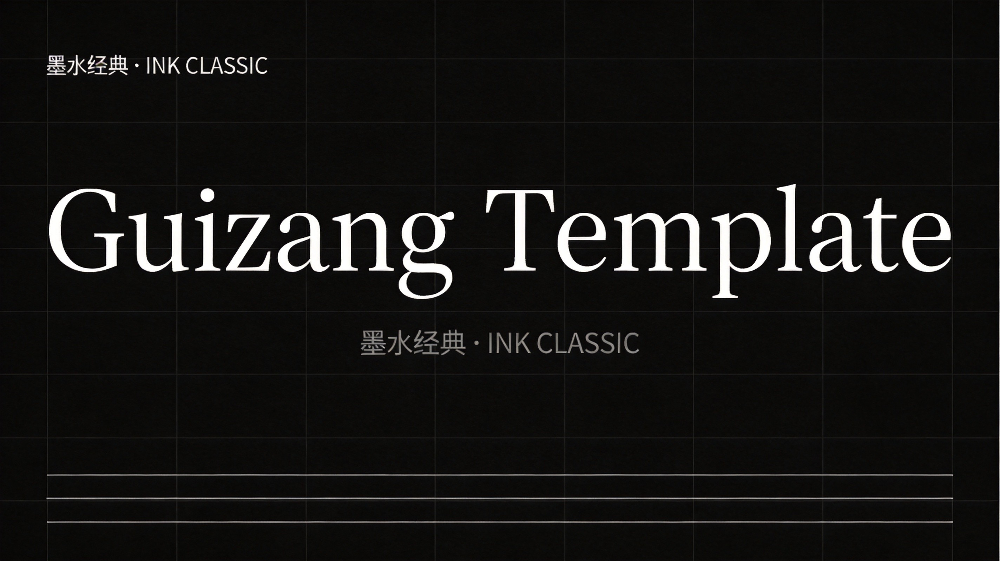
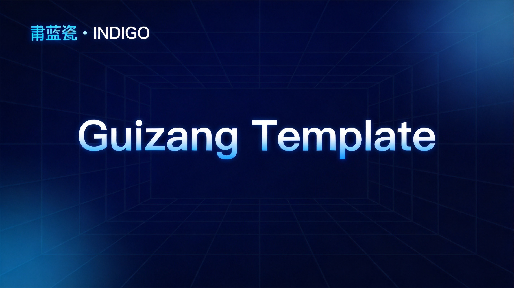
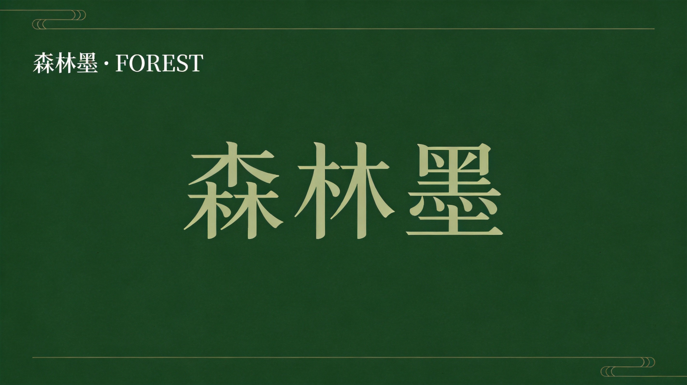
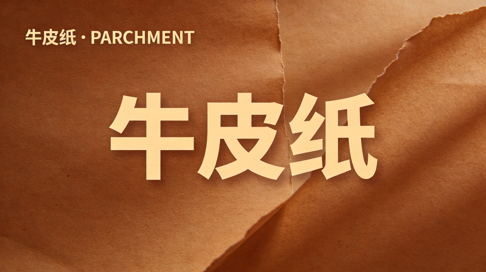
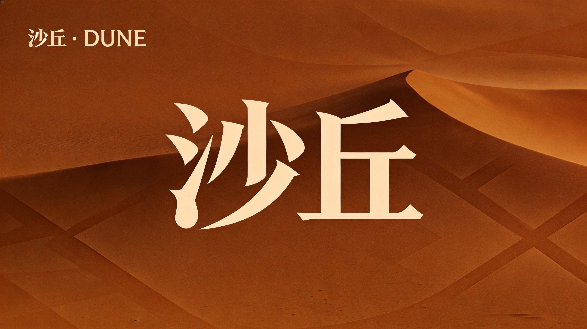
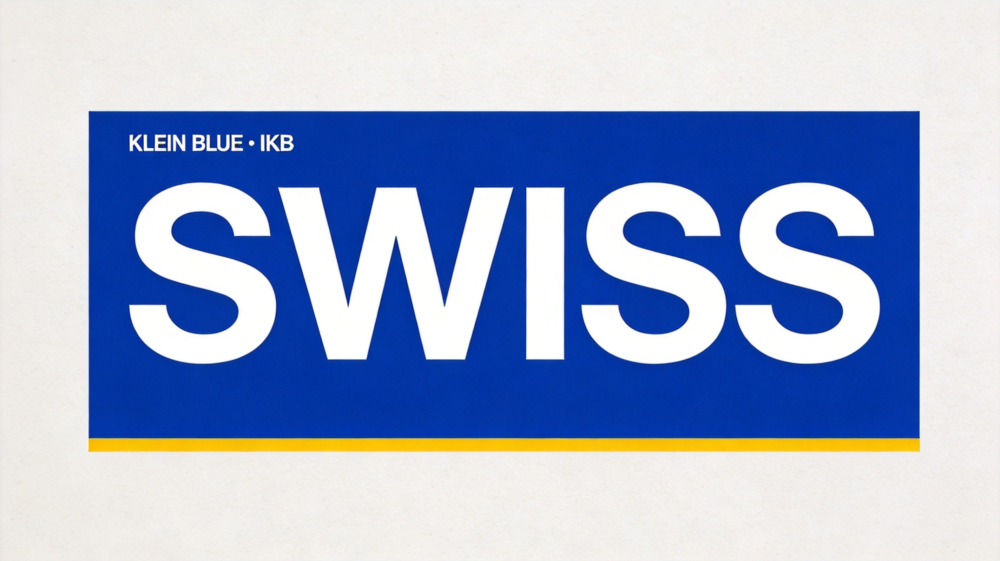
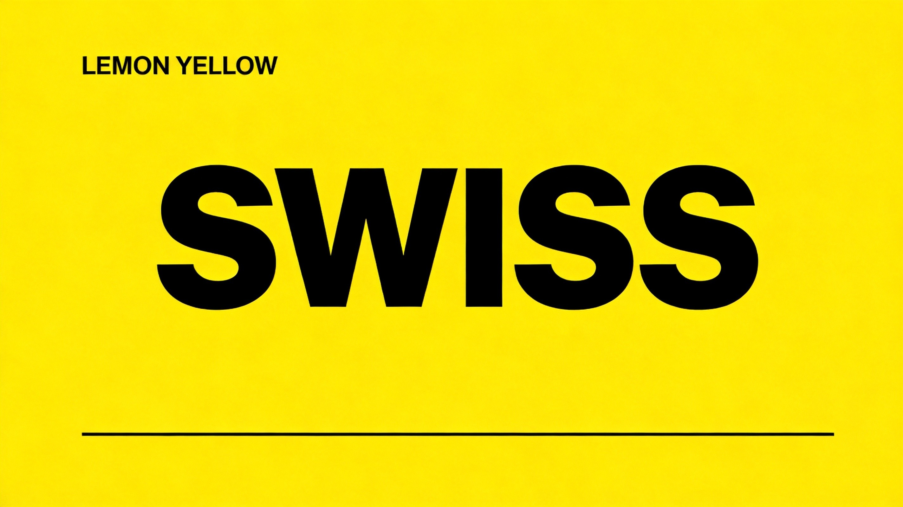
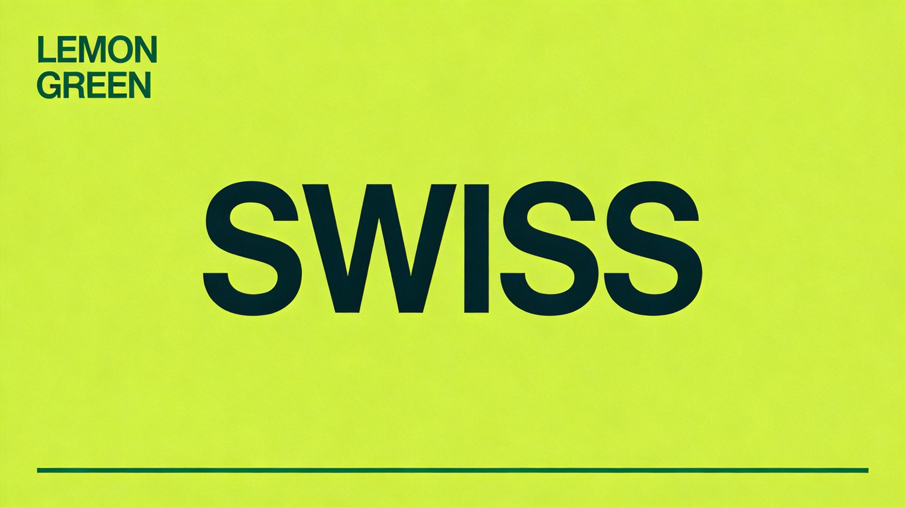
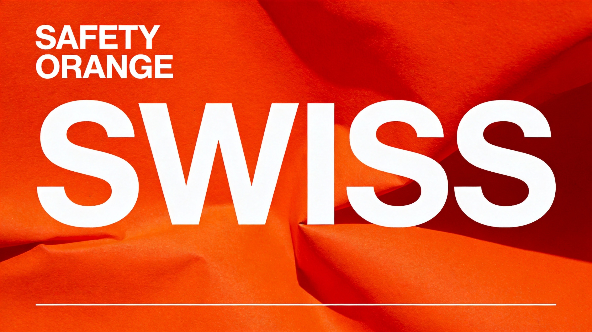

# Guizang Theme Showcase

**Generated**: 2026-06-01  
**Themes**: 9 total — 5× Style A (Electronic Magazine) + 4× Style B Swiss

---

## Style A — 电子杂志风 (Electronic Magazine)

| Theme | Name | BG | Text | Best For |
|-------|------|-----|------|----------|
|  | 墨水经典 · Ink Classic | `#0f0f0f` | `#f5f5f0` | 通用商业 |
|  | 靛蓝瓷 · Indigo | `#1a3a5c` | `#c8dff0` | 科技/AI |
|  | 森林墨 · Forest | `#1a3020` | `#c8dcc0` | 自然/文化 |
|  | 牛皮纸 · Parchment | `#3d2b1f` | `#e8d5b5` | 怀旧/人文 |
|  | 沙丘 · Dune | `#4a3525` | `#d4b896` | 艺术/设计 |

## Style B Swiss — 瑞士色板

| Theme | Name | Hex | Notes |
|-------|------|-----|-------|
|  | 克莱因蓝 · Klein Blue | `#002FA7` | International Klein Blue |
|  | 柠檬黄 · Lemon Yellow | `#FFD500` | High contrast |
|  | 柠檬绿 · Lemon Green | `#C5E803` | Fresh, crisp |
|  | 安全橙 · Safety Orange | `#FF6B35` | High energy |

---

## Usage

Apply a theme by replacing the `:root` CSS variable block in your deck's `<style>` section:

```css
:root {
  --paper:  #ffffff;     /* adjust per theme */
  --ink:    #050505;     /* adjust per theme */
  --grey-1: #f3f3f3;
  --grey-2: #d8d8d8;
  --grey-3: #6b6b6b;
  --accent: #002FA7;     /* theme accent color */
  /* ... */
}
```

All themes are rendered with the Swiss locked-mode component system (`S01–S22` layouts). Theme colors are applied via CSS custom properties.

---

## Files

- `style-a-ink-classic.jpg` — Style A 墨水经典
- `style-a-indigo-porcelain.jpg` — Style A 靛蓝瓷
- `style-a-forest-ink.jpg` — Style A 森林墨
- `style-a-parchment.jpg` — Style A 牛皮纸
- `style-a-dune.jpg` — Style A 沙丘
- `swiss-ikb-blue.jpg` — Style B Swiss 克莱因蓝
- `swiss-lemon-yellow.jpg` — Style B Swiss 柠檬黄
- `swiss-lemon-green.jpg` — Style B Swiss 柠檬绿
- `swiss-safety-orange.jpg` — Style B Swiss 安全橙
